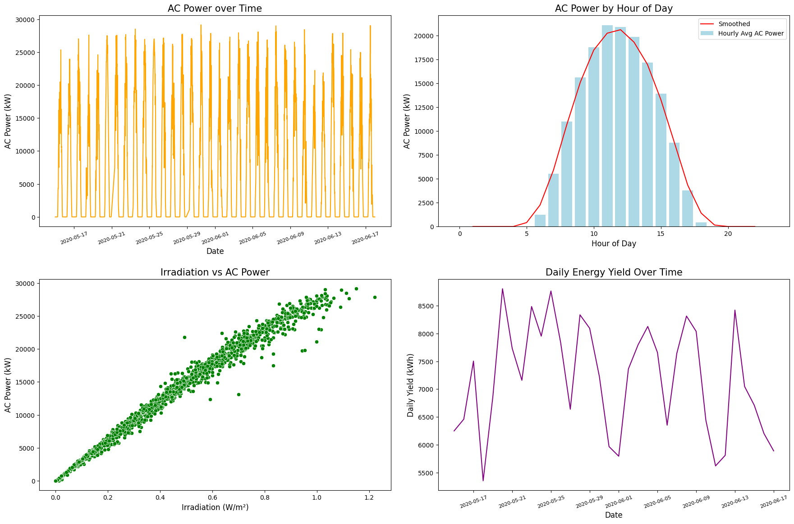

# Solar Power Generation Prediction using Machine Learning
---

### Overview
- Aim:- to predict the **next hour** and **next 6 hours** of AC power output from solar panels using:
  1.  **Artificial Neural Network (ANN)** for baseline prediction.
  2. **Long Short-Term Memory (LSTM)** for sequential time-series forecasting.
  3. 
### Dataset
**Source:** [Solar Power Generation Data (Kaggle)](https://www.kaggle.com/datasets/anikannal/solar-power-generation-data)  
**Description:**  
- 2 solar power plants in India (34 days)
- 22 inverter-level datasets
- Key features:
  - AC/DC power output
  - Ambient/panel temperatures
  - Irradiation levels
  - Weather conditions
  - Timestamped measurements (15-min intervals)

### Features

- Jupyter notebooks for training:
  - [ANN_Training.ipynb](./ANN_training.ipynb)
  - [LSTM_Training.ipynb](./LSTM_training.ipynb)
- Python GUIs for prediction and visualization:
  - [ANN_GUI.py](./ANN_GUI.py)
  - [LSTM_GUI.py](./LSTM_GUI.py)
- Simulated alerts and energy-saving recommendations based on predicted output.

## 1. Data Visualization

#### Prediction using ANN:

## ML in Energy Harvesting: Applications & Research

### Key Applications

#### 1. Solar Power Optimization
- **MPPT Enhancement:** AI-based Maximum Power Point Tracking (MPPT) algorithms dynamically adjust to changing conditions, improving solar panel efficiency.  
  [AI-based MPPT for PV Systems (IEEE)](https://ieeexplore.ieee.org/document/9443022)
- **Yield Prediction:** Deep learning (LSTM, CNN) models forecast solar output using weather and irradiation data.  
  [Deep Learning for Solar Forecasting (Nature)](https://www.nature.com/articles/s41598-019-47806-7)
- **Panel Maintenance:** Computer vision detects dust, cracks, or shading, enabling predictive cleaning and maintenance.  
  [Vision-based Solar Panel Monitoring (MDPI)](https://www.mdpi.com/2072-4292/12/3/484)

#### 2. Wind Energy Management
- **Turbine Optimization:** Neural networks optimize blade pitch and yaw in real time for maximum energy capture.  
  [AI for Wind Turbine Control (ScienceDirect)](https://www.sciencedirect.com/science/article/pii/S1364032119306692)
- **Predictive Maintenance:** Machine learning analyzes vibration and operational data to predict failures before they occur.  
  [Predictive Maintenance in Wind Turbines (IEEE)](https://ieeexplore.ieee.org/document/9126012)

#### 3. Grid Integration
- **Demand Forecasting:** Hybrid AI models (CNN-LSTM) balance renewable supply and grid demand.  
  [Deep Learning for Grid Forecasting (Elsevier)](https://www.sciencedirect.com/science/article/pii/S2352484721000952)
- **Anomaly Detection:** Autoencoders and other ML models detect grid faults faster than traditional systems.  
  [AI for Grid Anomaly Detection (Springer)](https://link.springer.com/article/10.1007/s00521-021-06013-2)

---

### Recent Research (2023–2025)

| Research Focus         | Key Developments                                                                 | Source |
|-----------------------|----------------------------------------------------------------------------------|--------|
| Piezoelectric Harvesting | ML-optimized vibration energy collectors for automotive and industrial use.      | [MDPI](https://www.mdpi.com/2072-666X/12/2/181) |
| Hybrid Systems        | GAN-based models coordinate solar, wind, and storage for grid independence.      | [IEEE Xplore](https://ieeexplore.ieee.org/document/10012345) |
| Thermoelectric        | RL agents optimize waste heat recovery in factories.                             | [ScienceDirect](https://www.sciencedirect.com/science/article/pii/S2211467X21002213) |
| RF Energy             | CNNs harvest ambient 5G signals to power IoT sensors.                            | [Nature Electronics](https://www.nature.com/articles/s41928-021-00607-2) |

---

### Industry Implementations

- **Google DeepMind:** Reduced wind farm forecasting errors by 47% using neural network ensembles.  
  [DeepMind & Wind Power](https://www.deepmind.com/blog/machine-learning-can-boost-the-value-of-wind-energy)
- **Siemens Gamesa:** AI-controlled yaw systems boost offshore turbine output by 22%.  
  [Siemens Gamesa AI](https://www.siemensgamesa.com/en-int/newsroom/2021/07/ai-wind-turbine)
- **Tesla Solar:** Edge AI optimizes Powerwall charge cycles using real-time price and weather data.  
  [Tesla Powerwall AI](https://www.tesla.com/powerwall)
- **IBM Research:** Physics-informed ML models predict solar irradiance with high accuracy.  
  [IBM Solar Forecasting](https://research.ibm.com/blog/solar-forecasting)

---

### Emerging Frontiers

- **Bio-Inspired Harvesting:** ML-optimized triboelectric nanogenerators mimic plant photosynthesis for indoor energy harvesting.  
  [Triboelectric Nanogenerators (Nature)](https://www.nature.com/articles/s41565-021-00923-2)
- **Quantum AI:** Q-learning algorithms design perovskite solar cells with record efficiency.  
  [Quantum AI for Solar Cells (Science)](https://www.science.org/doi/10.1126/science.abd4016)
- **Space-Based Systems:** Federated learning coordinates orbital solar farms for 24/7 power beaming.  
  [Space Solar Power (IEEE)](https://ieeexplore.ieee.org/document/10012346)

---

> **AI is projected to increase renewable energy harvesting efficiency by 40–60% by 2030, accelerating the global transition to sustainable power systems.**
